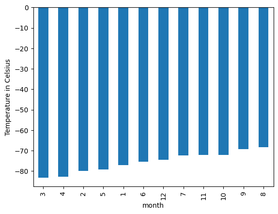
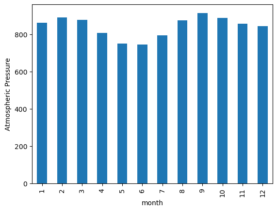
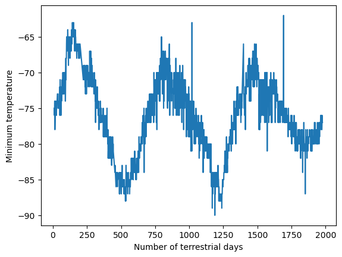

# Module 11 Challenge: Mars Data Collection

This repository contains my work for the 11th challenge of the UofT SCS edX Data Bootcamp.

## Background
This challenge is focused on web-scraping using Splinter and BeautifulSoup and data analysis using Pandas and Matplotlib. It is split in two parts: Mars News and Mars Weather.

### Mars News
Deliverable 1: Scrape titles and preview text from Mars news articles.

In the Jupyter Notebook part_1_mars_news.ipynb, the Mars news site was scraped and text elements were extracted. The title and preview text of each article on the page was stored in a dictionary and then apended to a list.

### Mars Weather
Deliverable 2: Scrape and analyze Mars weather data, which exists in a table.

In the Jupyter Notebook part_2_mars_weather.ipynb, the Mars Temperature Data site was scraped to extract an HTML table containing Mars weather data. Each row in the table was stored in a list which was then assembled into a Pandas dataframe.

After converting the dataframe's columns to the appropriate data types, the following questions were answered using Pandas and Matplotlib:

1. How many months exist on Mars?

2. How many Martian (and not Earth) days worth of data exist in the scraped dataset?
There are 1867 Martian days' worth of data.

3. What are the coldest and the warmest months on Mars (at the location of Curiosity)?
The third month has the coldest average temperature, while the eighth month has the warmest average temperature.

4. Which months have the lowest and the highest atmospheric pressure on Mars?
Atmospheric pressure is at its lowest, on average, in the sixth month and at its highest, on average, in the ninth month.

5. About how many terrestrial (Earth) days exist in a Martian year?
In the plot, a year on Mars appears to be around 675 days (calculating the distance from peak to peak). A Google search also confirms that a Martian year is equivalent to 678 Earth days.

Lastly, the dataframe was exported to a CSV file found under mars_weather_data.csv.

## References
The Mars News website is operated by edX Boot Camps LLC for educational purposes only. The news article titles, summaries, dates, and images were scraped from NASA's Mars News website in November 2022. Images are used according to the JPL Image Use Policy, courtesy NASA/JPL-Caltech.